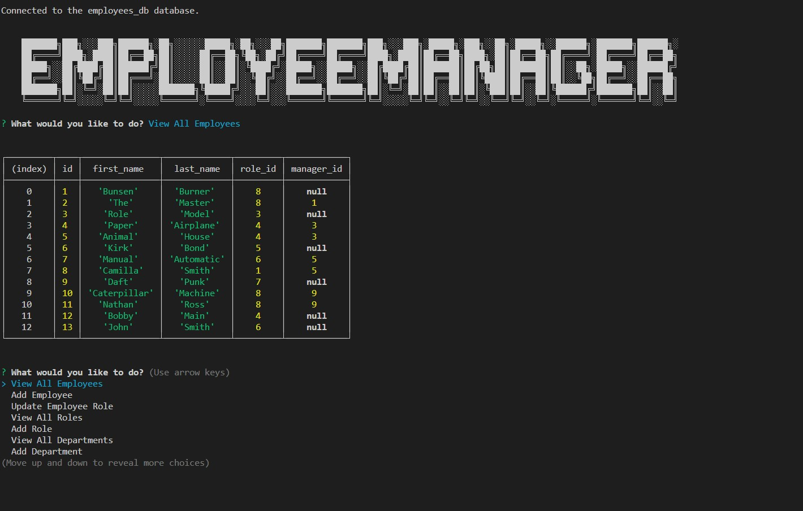

# Role Call     <svg xmlns="http://www.w3.org/2000/svg" xmlns:xlink="http://www.w3.org/1999/xlink" width="82" height="20" role="img" aria-label="License: MIT"><title>License: MIT</title><linearGradient id="s" x2="0" y2="100%"><stop offset="0" stop-color="#bbb" stop-opacity=".1"/><stop offset="1" stop-opacity=".1"/></linearGradient><clipPath id="r"><rect width="82" height="20" rx="3" fill="#fff"/></clipPath><g clip-path="url(#r)"><rect width="51" height="20" fill="#555"/><rect x="51" width="31" height="20" fill="#dfb317"/><rect width="82" height="20" fill="url(#s)"/></g><g fill="#fff" text-anchor="middle" font-family="Verdana,Geneva,DejaVu Sans,sans-serif" text-rendering="geometricPrecision" font-size="110"><text aria-hidden="true" x="265" y="150" fill="#010101" fill-opacity=".3" transform="scale(.1)" textLength="410">License</text><text x="265" y="140" transform="scale(.1)" fill="#fff" textLength="410">License</text><text aria-hidden="true" x="655" y="150" fill="#010101" fill-opacity=".3" transform="scale(.1)" textLength="210">MIT</text><text x="655" y="140" transform="scale(.1)" fill="#fff" textLength="210">MIT</text></g></svg>
      

  ## Description
    This application uses SQL to manager and update a server that can track employees, roles and departments.
  ## Table of Contents
  - [Installation](#installation)
  - [Usage](#usage)
  - [Credits](#credits)
  - [License](#license)
  - [Tests](#tests)
  - [Questions](#questions)

  ## Installation
  After downloading the repo, in the terminal for the root folder of the app do a npm i to install all dependencies.  Then npm start will pull start the application.

  ## Usage
 In the terminal you can you your arrow keys to navigate the menu and press enter to use which ever function you are currently on and press exit when you are done with the application 

 Link for walkthrough: https://drive.google.com/file/d/1pY715tXZQ_l4DdIAM2HmCXIlwi6BIzBw/view

  
  ## Credits

  ## License
    The license this application is covered under is MIT
    You can find more information on the license at https://choosealicense.com/licenses/mit/

  ## Tests
  n/a

  ---
  ## Questions
  https://github.com/ejasato

  eric.j.asato@gmail.com